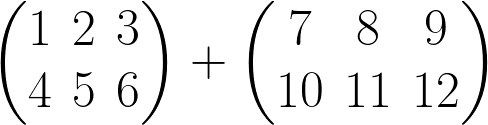
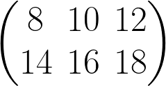
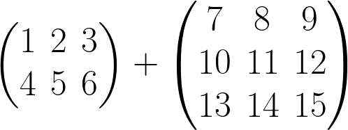

# The Phantom of the Matrix #
What is the sum of the following two matrices?

Well, this a pretty simple question. It's the following matrix:

Next question. What's the sum of the following two matrices?

Hmm, well this question doesn't really make sense. You can't add two matrices
if they aren't the same size! This repository contains an implementation of
vectors and matrices where illegal operations like these are caught and
rejected at compile time. Only valid vector and matrix additions are
well-typed.

The code was inspired heavily by [this blog
post](http://jadpole.github.io/rust/typechecked-matrix/).
